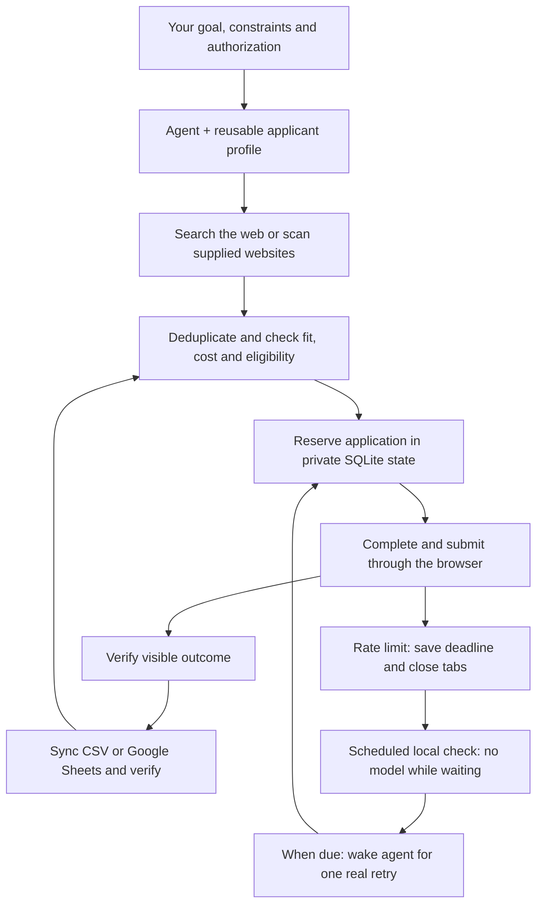

# Eventmaxxer

  
  
  
  
  
  

https://github.com/user-attachments/assets/1c31d9b3-0cf7-4643-a9a0-9776463e8cca

45 minutes of me afk sped up 10x

**Give your agent an event goal. It searches the web, finds matching events, and applies in bulk.**

Conferences, meetups, workshops, dinners, talks, hackathons, community gatherings, or
any other event type: the goal determines what fits. Start with a goal, specific websites,
or both. The agent discovers sources, extracts listings, reviews registration pages,
and keeps applying to eligible events within your authorization.

Open this repo in Codex, Claude Code, or another agent with computer-use tools and say:

> Search the web for events where I can learn about robotics in San Francisco next
> month. Apply to all eligible free events and keep a tracker sorted by day and time.

Or point it at a site:

> Scan this community calendar and its linked event pages for workshops, talks, and
> meetups this month. Register me for every eligible free event that fits my interests.

Or, from another workspace, tell your agent to read this clone's **EVENTMAXXER.md**.
The agent handles setup and asks only for missing information.

An agent distro is a portable bundle of instructions, skills, scripts and state conventions.
Your chosen agent supplies the model, browser and connected tools. Eventmaxxer supplies
the event workflow and reliable local state. Inspired by
[Continual Outreach](https://github.com/giga-james/continual-outreach).

## Three core features

1. **A maintained applicant profile.** Reuse verified professional facts, preserve their
   source and history, flag stale facts, and ask missing questions individually. Keep
   event-specific answers and consent separate from reusable facts.
2. **Goal-driven discovery and bulk applications across event sites.** Search the web
   or scan supplied websites, extract matching listings, and follow registration links
   using the current agent's supported tools. Check cost and eligibility, deduplicate
   alternate links, complete forms and verify each result. Keep working through the
   campaign rather than stopping after an arbitrary batch.
3. **Wakeups after rate limits.** A tiny Python process checks local deadlines without
   calling a model or opening a browser. Once due, it invokes the configured agent for
   one real retry. Successful submissions resume continuous work; another limit saves a
   new deadline and closes the tab.

The local runner does **not** ping private RSVP endpoints. Only a real submission can
establish that a submission limit cleared. Default retry spacing is 20 minutes, or longer
when the service specifies a later Retry-After.

## What stays reliable

- SQLite transactions and durable submission reservations prevent simultaneous local
  submissions and accidental retries after an ambiguous result.
- Account-wide URL identities and explicit aliases prevent duplicate applications across
  campaigns sharing the same state home.
- Cooldowns are scoped by account and registration service.
- One application at a time, maximum three event tabs, and no live-tab backlog.
- Verified applications must be synced before the next submission.
- CSV exports preserve attendance decisions and notes, and sort by local date/time.
  Google Sheets is supported through the agent's connector workflow.
- Pending, waitlisted and admitted are different outcomes.

## Start

Requires Python 3.9+ on macOS/Linux for the optional local runner; no third-party Python
packages are needed. The agent runtime must provide an authenticated supported browser.
Spreadsheet integration additionally requires a Sheets connector.

The header video is supplied for this README; applicant profiles and campaign records
stay outside the repository. State defaults to
~/.local/share/eventmaxxer/ and should be backed up privately. The same profile and
account labels should be reused when switching agents or campaigns.

New campaigns begin in draft mode. Tell the agent your goal, constraints and permission
to apply; sources are optional. It saves the configuration and profile and discovers
relevant sources when needed. Existing authorization
carries forward within scope.

> Keep this running and resume after rate limits. Set up the scheduler for me.

The agent discovers its runtime, probes scheduled tool access, and installs one suitable
scheduler. A desktop heartbeat is a fallback where CLI browser access is unavailable;
unlike the local gate, a heartbeat already invokes the model. Neither scheduler is
installed merely by cloning this repo.

## Architecture

Eventmaxxer gives your existing agent a repeatable workflow. The agent supplies reasoning,
web search, an authenticated computer-use browser and optional spreadsheet connectors.
The repository supplies instructions and local Python helpers for durable state, exports
and scheduled recovery. Browser interactions perform the applications; the helpers keep
the campaign consistent between sessions.

**Discovery follows the goal.** The agent turns your interests, dates and location into
searches, scans relevant websites and follows registration links. It saves source coverage
and event identities so another session can continue without starting over. Each event is
reviewed against your preferences before it enters the application queue.

**Private state coordinates the work.** `scripts/state.py` stores profile facts, event
records, unanswered questions and submission outcomes in SQLite under
`~/.local/share/eventmaxxer/`. Its gate checks authorization, unresolved submissions,
tracker sync and service cooldowns before another application. Reservations and account-wide
URL identities protect campaigns sharing that state home from duplicate submissions.

**Each application closes the loop.** The agent fills one form at a time and records
the visible result, keeping pending, waitlisted and admitted distinct. It exports verified
outcomes through `scripts/export.py` or a Sheets connector and checks the tracker before
continuing. Missing answers are saved for you; ambiguous submissions are reconciled before
another attempt.

**Scheduling resumes eligible work.** An optional scheduler calls `scripts/wake.py`.
While the local gate says wait or idle, it makes no model, browser or network call. When
work is actionable, the runner invokes the configured agent, serializes runs for that
account and saves private logs. A desktop heartbeat can provide an alternative when
scheduled CLI sessions lack browser access; that alternative does invoke the model.

| File | Purpose |
| --- | --- |
| EVENTMAXXER.md | Portable conversational entrypoint |
| .agents/skills/eventmaxxer/SKILL.md | Application workflow |
| scripts/state.py | Profile, events, questions, reservations, cooldowns, sync gates |
| scripts/wake.py | Zero-model cooldown checks and serialized agent invocation |
| scripts/export.py | Verified CSV export with preserved user choices |
| docs/scheduling.md | Agent-managed scheduler setup |
| docs/state.md | State and command reference |
| docs/tracking.md | Sheet sync and legacy campaign migration |

## Validation

Run:

    python3 -m unittest discover -s tests -v

Tests use temporary state and fake agents, with no live RSVP requests.

This is an initial implementation. Generic computer use supports reviewing arbitrary
sites, but cannot guarantee access, eligibility or automatic completion of every form.
Tool access in a scheduled CLI can differ from the desktop. Local locks do not coordinate
different machines/state homes. Do not run two schedulers against the same account.
