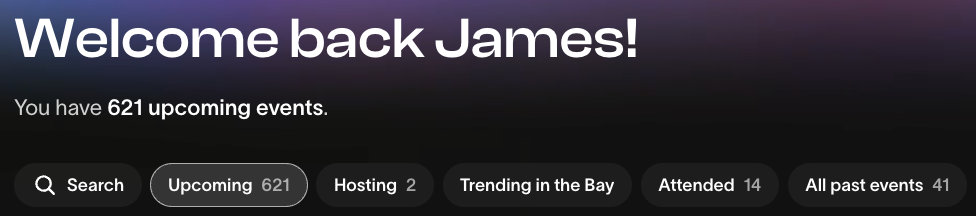
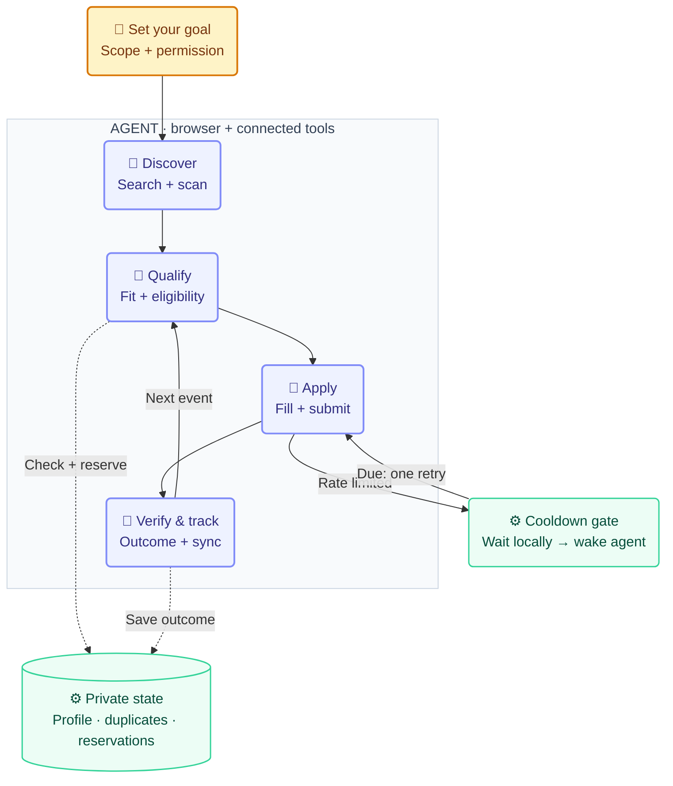

# Eventmaxxer

<p align="center">
  <a href="#architecture"></a>
  <a href="#start"></a>
  <a href="#start"></a>
  <a href="#three-core-features"></a>
  <a href="#start"></a>
  <a href="#validation"></a>
</p>

https://github.com/user-attachments/assets/1c31d9b3-0cf7-4643-a9a0-9776463e8cca

<p align="center"><sub>45 minutes of me afk sped up 10x</sub></p>

**Give your agent an event goal. It finds matching events and applies in bulk.**

Meetups, conferences, workshops, dinners, hackathons—any event type. Start with a goal,
a website, or both. Your agent handles discovery, applications and tracking.

## Start

Open this repo in an agent with computer-use tools and say:

> Find robotics events in San Francisco next month. Apply to every eligible free event
> and track the results by date.

Working elsewhere? Ask your agent to read [EVENTMAXXER.md](EVENTMAXXER.md).
It reuses your profile and asks only for missing details. To enable automatic resume, add:

> Keep this running and resume after rate limits. Set up the scheduler for me.

**Requires:** an authenticated browser supported by your agent. The optional local runner
uses Python 3.9+ on macOS/Linux; Google Sheets needs a connector.

## Results

An event calendar full of options:

<p align="center">
  
  <br><sub>left to go watch jojo's, but we keep eventmaxxing</sub>
</p>

## Three core features

| | What it does |
| --- | --- |
| 👤 **Reusable profile** | Saves verified facts so you do not repeat the same answers. |
| 🌐 **Discover and apply** | Searches websites, checks fit and eligibility, and applies to matching free events. |
| ⏱ **Resume automatically** | Saves cooldowns and wakes the agent when it can retry. |

## Architecture

Your agent operates the browser. Local helpers preserve state and coordinate retries.
**🤖 = agent-controlled step · ⚙ = local helper · 👤 = you**



- **Apply once:** deduplicate events, reserve each submission, and reconcile uncertain results.
- **Verify before continuing:** pending, waitlisted and admitted stay distinct; sync each result.
- **Resume cheaply:** the optional local runner waits without model calls. A desktop heartbeat
  is an alternative when CLI browser access is unavailable and does invoke the model.

Profiles and campaign records stay in `~/.local/share/eventmaxxer/`, outside the repo.
Use one scheduler per account; local locks do not coordinate separate machines.
Sites may still require missing answers, login or manual steps.

[Agent workflow](.agents/skills/eventmaxxer/SKILL.md) ·
[State & commands](docs/state.md) · [Scheduling](docs/scheduling.md) ·
[Tracking & exports](docs/tracking.md)

## Validation

```sh
python3 -m unittest discover -s tests -v
```

Tests use temporary state and fake agents, with no live applications.

Inspired by [Continual Outreach](https://github.com/giga-james/continual-outreach).
